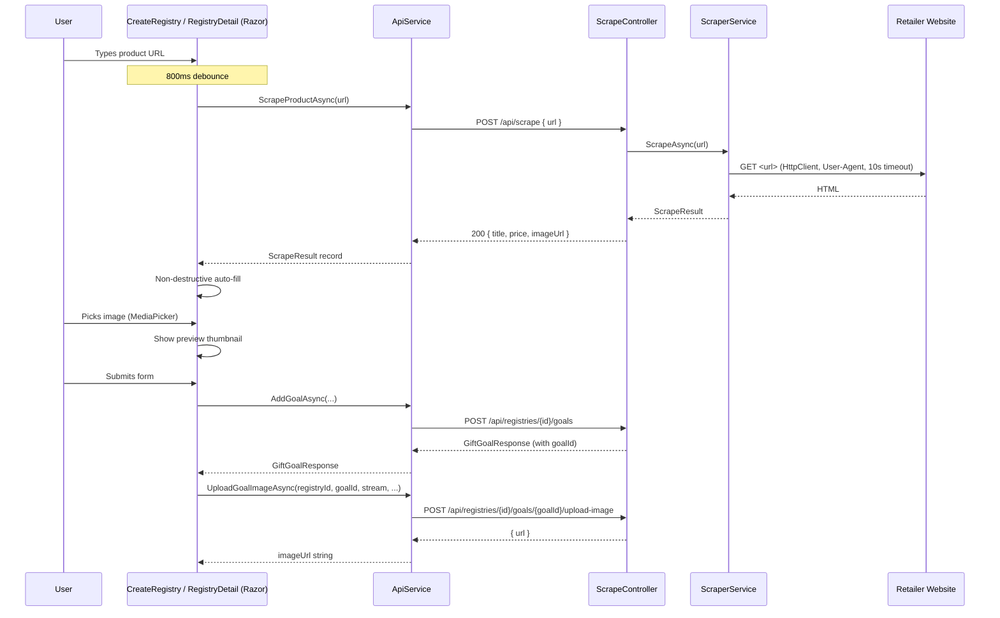

# Design Document: Goal Image Upload & Product Link Scrape

## Overview

This feature adds two capabilities to the "Add gift goal" form, which appears in both `CreateRegistry` Step 2 and the `RegistryDetail` add-goal `BottomSheet`:

1. **Goal image picker** — the user selects a photo from their device gallery or captures one with the camera. The image is previewed immediately and uploaded to the existing `POST /api/registries/{id}/goals/{goalId}/upload-image` endpoint after the goal is created.

2. **Product link auto-fill** — when the user types a product URL, an 800 ms debounce fires a call to a new `POST /api/scrape` backend endpoint. The endpoint fetches the retailer page using `HtmlAgilityPack`, extracts title, price, and image, and returns a `ScrapeResult`. The mobile app non-destructively populates empty form fields from the result.

### Scope

| Layer | Change |
|---|---|
| **GiftTogether** (ASP.NET Core) | New `ScrapeController`, new `ScraperService` with per-retailer strategies, new `ScrapeResult` DTO |
| **GiftTogether.Mobile** (MAUI Blazor Hybrid) | New `ScrapeResult` record in `ApiService`, two new methods in `ApiService`, UI changes to `CreateRegistry.razor` and `RegistryDetail.razor` |

---

## Architecture



### Key Design Decisions

- **No headless browser**: `HtmlAgilityPack` is sufficient for all five target retailers because their product pages render critical metadata in the initial HTML response (title, OG tags, price in a `<span>`). This keeps the backend lightweight and avoids Playwright/Puppeteer complexity.
- **Retailer allowlist on the backend**: The mobile app sends the raw URL; the backend validates the domain. This prevents the scrape endpoint from being used as an open proxy.
- **Debounce via `CancellationTokenSource`**: The Razor component cancels the previous pending scrape whenever the URL field changes, then starts a new 800 ms timer. This is idiomatic in MAUI Blazor and avoids JavaScript interop.
- **Upload-after-create**: The backend requires a `goalId` for the upload endpoint, so the image upload is a two-step operation: create goal → upload image. If the upload fails, the goal is retained and an error is shown.
- **Non-destructive fill**: Auto-fill only writes to fields that are currently empty/zero. This respects any value the user typed before or after the scrape completes.

---

## Components and Interfaces

### Backend: `ScrapeController`

```csharp
// GiftTogether/Controllers/ScrapeController.cs
[ApiController]
[Route("api/scrape")]
public class ScrapeController : ControllerBase
{
    private readonly ScraperService _scraper;
    private readonly TokenService _tokens;

    public ScrapeController(ScraperService scraper, TokenService tokens) { ... }

    // POST /api/scrape
    // Body: { "url": "https://..." }
    // Auth: Bearer token required
    // Returns: 200 ScrapeResultDto | 400 | 422 | 502
    [HttpPost]
    public async Task<IActionResult> Scrape([FromBody] ScrapeRequest req);
}
```

**Request / response shapes:**

```csharp
// GiftTogether/DTOs/ScrapeDtos.cs
public record ScrapeRequest(string Url);

public record ScrapeResultDto(
    string? Title,
    decimal? Price,
    string? ImageUrl
);
```

**Error shapes** (all use `{ "error": "..." }`):

| Status | Condition |
|---|---|
| 400 | URL is missing, empty, or not a valid URI |
| 422 | URL host is not in the supported-retailer allowlist |
| 502 | `HttpClient` threw `HttpRequestException` or `TaskCanceledException` |

---

### Backend: `ScraperService`

```csharp
// GiftTogether/Services/ScraperService.cs
public class ScraperService
{
    // Injected via DI; configured with 10s timeout and browser-like User-Agent
    private readonly HttpClient _http;

    // Ordered list of retailer strategies; checked by domain match
    private readonly IReadOnlyList<IRetailerStrategy> _strategies;

    // Supported domains (used by controller for 422 check)
    public static readonly IReadOnlySet<string> AllowedHosts = new HashSet<string>(
        StringComparer.OrdinalIgnoreCase)
    {
        "www.takealot.com", "takealot.com",
        "www.woolworths.co.za", "woolworths.co.za",
        "www.checkers.co.za", "checkers.co.za",
        "www.game.co.za", "game.co.za",
        "www.makro.co.za", "makro.co.za"
    };

    /// <summary>
    /// Fetches the page at <paramref name="url"/> and extracts product metadata.
    /// Returns a ScrapeResultDto with all-null fields if nothing can be extracted.
    /// Throws HttpRequestException / TaskCanceledException on network failure.
    /// </summary>
    public async Task<ScrapeResultDto> ScrapeAsync(string url);
}
```

#### Retailer Strategy Interface

```csharp
// GiftTogether/Services/Scraping/IRetailerStrategy.cs
public interface IRetailerStrategy
{
    /// <summary>Returns true if this strategy handles the given host.</summary>
    bool Matches(string host);

    /// <summary>
    /// Extracts title, price, and imageUrl from the already-loaded HtmlDocument.
    /// Returns null for any field that cannot be found.
    /// </summary>
    (string? Title, decimal? Price, string? ImageUrl) Extract(HtmlDocument doc);
}
```

#### Per-Retailer Strategies

Each strategy is a small class in `GiftTogether/Services/Scraping/`. The extraction logic for each retailer is described below.

**`TakealotStrategy`**

| Field | Primary selector | Fallback |
|---|---|---|
| Title | `h1.pdp-title` | `<title>` tag, strip ` \| Takealot.com` suffix |
| Price | `span.currency.plus` (contains `R`) | `meta[property="product:price:amount"]` |
| Image | `img.pdp-image` (first `src`) | `meta[property="og:image"]` |

**`WoolworthsStrategy`**

| Field | Primary selector | Fallback |
|---|---|---|
| Title | `h1.product-name` | `<title>` tag, strip ` - Woolworths` suffix |
| Price | `strong.price` | `meta[property="product:price:amount"]` |
| Image | `meta[property="og:image"]` | `img.product-image` first `src` |

**`CheckersStrategy`**

| Field | Primary selector | Fallback |
|---|---|---|
| Title | `h1.pdp__name` | `<title>` tag |
| Price | `div.pdp__price` (text node) | `meta[property="product:price:amount"]` |
| Image | `meta[property="og:image"]` | `img.pdp__image` first `src` |

**`GameStrategy`**

| Field | Primary selector | Fallback |
|---|---|---|
| Title | `h1.product-name` | `<title>` tag, strip ` - Game` suffix |
| Price | `span.price-box__price` | `meta[property="product:price:amount"]` |
| Image | `meta[property="og:image"]` | `img.product-image-photo` first `src` |

**`MakroStrategy`**

| Field | Primary selector | Fallback |
|---|---|---|
| Title | `h1.product-name` | `<title>` tag, strip ` - Makro` suffix |
| Price | `span.price-box__price` | `meta[property="product:price:amount"]` |
| Image | `meta[property="og:image"]` | `img.product-image-photo` first `src` |

**OG-tag fallback (all strategies)**

All strategies share a common base helper:

```csharp
// GiftTogether/Services/Scraping/StrategyBase.cs
public abstract class StrategyBase : IRetailerStrategy
{
    public abstract bool Matches(string host);
    public abstract (string? Title, decimal? Price, string? ImageUrl) Extract(HtmlDocument doc);

    protected static string? OgImage(HtmlDocument doc) =>
        doc.DocumentNode
           .SelectSingleNode("//meta[@property='og:image']")
           ?.GetAttributeValue("content", null);

    protected static string? OgTitle(HtmlDocument doc) =>
        doc.DocumentNode
           .SelectSingleNode("//meta[@property='og:title']")
           ?.GetAttributeValue("content", null);

    protected static string? PageTitle(HtmlDocument doc) =>
        doc.DocumentNode.SelectSingleNode("//title")?.InnerText.Trim();

    /// <summary>
    /// Parses a ZAR price string such as "R 1 299.99", "R1299,99", "1 299.99"
    /// into a decimal. Returns null if parsing fails.
    /// </summary>
    protected static decimal? ParseZarPrice(string? raw)
    {
        if (string.IsNullOrWhiteSpace(raw)) return null;
        // Strip currency symbol, spaces used as thousand separators, and non-numeric chars
        // except the decimal separator (last '.' or ',')
        var cleaned = Regex.Replace(raw, @"[R\s]", "");   // remove R and whitespace
        cleaned = Regex.Replace(cleaned, @"[,\.](?=\d{3})", ""); // remove thousand sep
        cleaned = cleaned.Replace(",", ".");               // normalise decimal comma
        cleaned = Regex.Replace(cleaned, @"[^\d\.]", ""); // strip remaining non-numeric
        return decimal.TryParse(cleaned, System.Globalization.NumberStyles.Any,
            System.Globalization.CultureInfo.InvariantCulture, out var result)
            ? result : null;
    }
}
```

---

### Mobile: `ApiService` additions

```csharp
// New DTO in GiftTogether.Mobile/Services/ApiService.cs
public record ScrapeResult(string? Title, decimal? Price, string? ImageUrl);

// New methods on ApiService:

/// <summary>
/// Calls POST /api/scrape and returns the deserialized ScrapeResult.
/// Throws Exception with the server error message on 400, 422, or 502.
/// </summary>
public async Task<ScrapeResult> ScrapeProductAsync(string url);

/// <summary>
/// Uploads a goal image via multipart/form-data to
/// POST /api/registries/{registryId}/goals/{goalId}/upload-image.
/// Returns the public URL string on success.
/// Throws Exception with the server error message on failure.
/// </summary>
public async Task<string> UploadGoalImageAsync(
    int registryId,
    int goalId,
    Stream stream,
    string fileName,
    string contentType);
```

**`ScrapeProductAsync` implementation sketch:**

```csharp
public async Task<ScrapeResult> ScrapeProductAsync(string url)
{
    SetAuthHeader();
    var res = await _http.PostAsJsonAsync("/api/scrape", new { url }, JsonOpts);
    // ReadOrThrow handles 400/422/502 by throwing with the error message
    return await ReadOrThrow<ScrapeResult>(res);
}
```

**`UploadGoalImageAsync` implementation sketch:**

```csharp
public async Task<string> UploadGoalImageAsync(
    int registryId, int goalId,
    Stream stream, string fileName, string contentType)
{
    SetAuthHeader();
    using var content = new MultipartFormDataContent();
    var streamContent = new StreamContent(stream);
    streamContent.Headers.ContentType =
        new System.Net.Http.Headers.MediaTypeHeaderValue(contentType);
    content.Add(streamContent, "image", fileName);

    var res = await _http.PostAsync(
        $"/api/registries/{registryId}/goals/{goalId}/upload-image", content);

    if (!res.IsSuccessStatusCode)
        throw new Exception(await GetError(res));

    var doc = await res.Content.ReadFromJsonAsync<JsonElement>(JsonOpts);
    return doc.GetProperty("url").GetString()!;
}
```

---

### Mobile: Razor component changes

Both `CreateRegistry.razor` (Step 2) and the add-goal `BottomSheet` in `RegistryDetail.razor` share the same goal form logic. The changes are identical in both locations.

#### New component state fields

```csharp
// Image picker state
Stream? _pickedImageStream;
string? _pickedImageFileName;
string? _pickedImageContentType;
string? _imagePreviewSrc;   // data URL or scraped URL for 

// Scrape state
CancellationTokenSource? _scrapeCts;
bool _scrapeLoading;
string? _scrapeError;
```

#### Image picker button (above the form or in the goal image area)

```razor
<!-- Image picker area -->
<div class="goal-image-picker">
    @if (_imagePreviewSrc != null)
    {
        
        <button class="btn btn--ghost btn--sm goal-image-clear"
                @onclick="ClearImage" aria-label="Remove image">✕</button>
    }
    else
    {
        <button class="btn btn--outline goal-image-pick-btn"
                @onclick="PickImageAsync" aria-label="Add goal image">
            📷
        </button>
    }
</div>
```

#### Product link field with scrape spinner

```razor
<div class="form-group">
    <label class="form-label" for="goal-link">
        Product link <span class="text-optional">(optional)</span>
    </label>
    <div class="input-with-indicator">
        <input id="goal-link" class="form-input" type="url"
               placeholder="https://takealot.com/..."
               @bind="_goalLink" @bind:event="oninput"
               @oninput="OnProductLinkInput" />
        @if (_scrapeLoading)
        {
            <span class="input-spinner" aria-label="Fetching product details…"></span>
        }
    </div>
    @if (_scrapeError != null)
    {
        <span class="form-error-msg form-error-msg--soft">⚠ @_scrapeError</span>
    }
</div>
```

#### Debounce handler

```csharp
async Task OnProductLinkInput(ChangeEventArgs e)
{
    _goalLink = e.Value?.ToString() ?? "";
    _scrapeError = null;

    // Cancel any pending scrape
    _scrapeCts?.Cancel();
    _scrapeCts?.Dispose();
    _scrapeCts = new CancellationTokenSource();
    var cts = _scrapeCts;

    if (string.IsNullOrWhiteSpace(_goalLink) ||
        !Uri.TryCreate(_goalLink, UriKind.Absolute, out _))
        return;

    try
    {
        await Task.Delay(800, cts.Token);
    }
    catch (TaskCanceledException)
    {
        return; // A newer keystroke cancelled this one
    }

    _scrapeLoading = true;
    StateHasChanged();

    try
    {
        var result = await Api.ScrapeProductAsync(_goalLink);
        ApplyAutoFill(result);
    }
    catch (Exception ex)
    {
        _scrapeError = ex.Message;
    }
    finally
    {
        _scrapeLoading = false;
        StateHasChanged();
    }
}

void ApplyAutoFill(ScrapeResult result)
{
    if (string.IsNullOrWhiteSpace(_goalName) && result.Title != null)
        _goalName = result.Title;

    if (_goalAmount == 0 && result.Price is > 0)
        _goalAmount = result.Price.Value;

    // Only set image preview from scrape if user has not picked a local image
    if (_pickedImageStream == null && result.ImageUrl != null)
        _imagePreviewSrc = result.ImageUrl;
}
```

#### Image picker handler

```csharp
async Task PickImageAsync()
{
    try
    {
        var photo = await MediaPicker.Default.PickPhotoAsync(
            new MediaPickerOptions { Title = "Select goal image" });

        if (photo == null) return;

        // Validate type
        var allowed = new[] { "image/jpeg", "image/png", "image/webp", "image/gif" };
        var ct = photo.ContentType ?? "image/jpeg";
        if (!allowed.Contains(ct.ToLower()))
        {
            _scrapeError = "Only JPEG, PNG, WebP, or GIF images are allowed.";
            return;
        }

        // Validate size (5 MB)
        await using var sizeCheck = await photo.OpenReadAsync();
        if (sizeCheck.Length > 5 * 1024 * 1024)
        {
            _scrapeError = "Image must be smaller than 5 MB.";
            return;
        }

        // Store for upload
        _pickedImageStream = await photo.OpenReadAsync();
        _pickedImageFileName = photo.FileName;
        _pickedImageContentType = ct;

        // Build preview data URL
        using var ms = new MemoryStream();
        await _pickedImageStream.CopyToAsync(ms);
        _pickedImageStream.Position = 0;
        var b64 = Convert.ToBase64String(ms.ToArray());
        _imagePreviewSrc = $"data:{ct};base64,{b64}";
    }
    catch (Exception ex)
    {
        _scrapeError = $"Could not open image: {ex.Message}";
    }
}

void ClearImage()
{
    _pickedImageStream?.Dispose();
    _pickedImageStream = null;
    _pickedImageFileName = null;
    _pickedImageContentType = null;
    _imagePreviewSrc = null;
}
```

#### Post-create upload call (in `AddGoalAsync`)

```csharp
async Task AddGoalAsync()
{
    // ... existing validation ...

    _goalLoading = true;
    try
    {
        var goal = await Api.AddGoalAsync(
            _registry!.Id,
            _goalName.Trim(),
            _goalDesc.Trim(),
            _goalAmount,
            string.IsNullOrWhiteSpace(_goalLink) ? null : _goalLink.Trim());

        // Upload image if one was picked
        if (_pickedImageStream != null)
        {
            try
            {
                _pickedImageStream.Position = 0;
                var uploadedUrl = await Api.UploadGoalImageAsync(
                    _registry.Id, goal.Id,
                    _pickedImageStream,
                    _pickedImageFileName!,
                    _pickedImageContentType!);
                // Optionally update goal.ImageUrl locally
            }
            catch (Exception uploadEx)
            {
                // Goal was saved; show non-fatal error
                _goalNameError = $"Goal saved, but image upload failed: {uploadEx.Message}";
            }
            finally
            {
                ClearImage();
            }
        }

        _addedGoals.Add(goal);
        ResetGoalForm();
    }
    catch (Exception ex)
    {
        _goalNameError = ex.Message;
    }
    finally
    {
        _goalLoading = false;
    }
}
```

---

## Data Models

### Backend DTOs (`GiftTogether/DTOs/ScrapeDtos.cs`)

```csharp
namespace GiftTogether.DTOs;

/// <summary>Request body for POST /api/scrape.</summary>
public record ScrapeRequest(string Url);

/// <summary>
/// Response body for POST /api/scrape.
/// All fields are nullable — the endpoint returns 200 even when nothing
/// could be extracted, with all fields set to null.
/// </summary>
public record ScrapeResultDto(
    string? Title,
    decimal? Price,
    string? ImageUrl
);
```

### Mobile DTO (`GiftTogether.Mobile/Services/ApiService.cs`)

```csharp
/// <summary>
/// Client-side mirror of ScrapeResultDto.
/// Returned by ApiService.ScrapeProductAsync.
/// </summary>
public record ScrapeResult(string? Title, decimal? Price, string? ImageUrl);
```

### No database changes

This feature does not add or modify any EF Core entities or migrations. The existing `GiftGoal.ImageUrl` and `GiftGoal.ProductLink` columns are sufficient.

---

## Correctness Properties

*A property is a characteristic or behavior that should hold true across all valid executions of a system — essentially, a formal statement about what the system should do. Properties serve as the bridge between human-readable specifications and machine-verifiable correctness guarantees.*

### Property 1: ZAR price parsing is total and correct

*For any* string that represents a South African Rand price (with or without the `R` symbol, with or without space or comma thousand separators, with either `.` or `,` as the decimal separator), `ParseZarPrice` SHALL return a `decimal` equal to the numeric value of the price, and SHALL return `null` for any string that contains no recognisable numeric value.

**Validates: Requirements 4.4**

---

### Property 2: Allowlist domain check is exhaustive

*For any* absolute URI string, `ScraperService.AllowedHosts.Contains(uri.Host)` SHALL return `true` if and only if the host is one of the five supported retailer domains (with or without the `www.` prefix), and `false` for all other hosts.

**Validates: Requirements 3.8, 4.7**

---

### Property 3: Non-destructive auto-fill preserves existing values

*For any* combination of pre-filled form field values (name, amount, imagePreviewSrc) and *any* `ScrapeResult`, after calling `ApplyAutoFill`:
- A field that was non-empty / non-zero before the call SHALL retain its original value.
- A field that was empty / zero before the call SHALL be set to the corresponding `ScrapeResult` value if that value is non-null.

**Validates: Requirements 2.2, 3.3, 3.4, 3.5, 3.6**

---

### Property 4: Image type validation is correct

*For any* MIME type string, the image-type validation SHALL accept the string if and only if it is one of `image/jpeg`, `image/png`, `image/webp`, or `image/gif` (case-insensitive), and SHALL reject all other strings.

**Validates: Requirements 1.7**

---

### Property 5: Image size validation is correct

*For any* non-negative integer `size` representing a file size in bytes, the size validation SHALL accept `size` if and only if `size <= 5 * 1024 * 1024` (5 242 880 bytes), and SHALL reject all larger values.

**Validates: Requirements 1.8**

---

### Property 6: Upload request targets the correct endpoint

*For any* `(registryId, goalId)` pair, `UploadGoalImageAsync` SHALL send a `POST` request to exactly `/api/registries/{registryId}/goals/{goalId}/upload-image` with a `multipart/form-data` body containing a part named `image`.

**Validates: Requirements 5.1**

---

### Property 7: Scrape API client round-trips ScrapeResult correctly

*For any* combination of nullable `Title`, `Price`, and `ImageUrl` values serialised as a JSON response body, `ScrapeProductAsync` SHALL deserialise the response into a `ScrapeResult` record whose fields exactly match the original values (including `null`).

**Validates: Requirements 6.1, 6.2**

---

### Property 8: Scrape API client propagates error messages

*For any* HTTP response with status 400, 422, or 502 and a JSON body containing an `"error"` field, `ScrapeProductAsync` SHALL throw an `Exception` whose `Message` equals the value of that `"error"` field.

**Validates: Requirements 6.3, 6.4**

---

### Property 9: Debounce fires exactly once per settled URL

*For any* sequence of URL input events that all arrive within 800 ms of each other and settle on a final non-empty valid URL, the scrape endpoint SHALL be called exactly once (for the final settled value), not once per keystroke.

**Validates: Requirements 3.1, 3.9**

---

## Error Handling

### Backend

| Scenario | HTTP status | Response body |
|---|---|---|
| Missing or empty `url` field | 400 | `{ "error": "Invalid URL." }` |
| `url` is not a valid absolute URI | 400 | `{ "error": "Invalid URL." }` |
| `url` host not in allowlist | 422 | `{ "error": "Unsupported retailer. Supported sites: Takealot, Woolworths, Checkers, Game, Makro." }` |
| `HttpClient` throws `HttpRequestException` | 502 | `{ "error": "Could not reach the product page." }` |
| `HttpClient` throws `TaskCanceledException` (timeout) | 502 | `{ "error": "Could not reach the product page." }` |
| Page reachable but no data extracted | 200 | `{ "title": null, "price": null, "imageUrl": null }` |
| Missing / invalid Bearer token | 401 | `{ "error": "Authentication required." }` |

The controller wraps the `ScraperService.ScrapeAsync` call in a `try/catch` for `HttpRequestException` and `TaskCanceledException`. All other exceptions bubble up as 500 (unhandled).

### Mobile

| Scenario | UI behaviour |
|---|---|
| Scrape returns error (any status) | Inline `_scrapeError` message shown below the product link field; all form fields unchanged |
| Image upload fails after goal creation | `_goalNameError` shows "Goal saved, but image upload failed: …"; goal appears in the added-goals list |
| `MediaPicker` returns `null` (user cancelled) | No-op; no error shown |
| Picked file is wrong type or too large | `_scrapeError` shows the validation message |
| Network timeout on scrape | `_scrapeError` shows the server's 502 error message |

---

## Testing Strategy

### Backend unit tests (`GiftTogether.Tests`)

**Framework**: xUnit + Moq + `FakeItEasy` (or Moq) for `HttpMessageHandler`

**Property-based tests**: Use [FsCheck](https://fscheck.github.io/FsCheck/) (NuGet: `FsCheck.Xunit`) configured for 100 iterations per property.

Each property test is tagged with a comment:
`// Feature: goal-image-and-product-scrape, Property {N}: {property_text}`

**Unit test coverage:**

- `ScrapeController` — 400 on invalid URL, 422 on unsupported domain, 502 on `HttpRequestException`, 200 with all-null on empty page, 401 on missing token
- `StrategyBase.ParseZarPrice` — specific examples: `"R 1 299.99"` → `1299.99m`, `"R1,299.99"` → `1299.99m`, `"1299"` → `1299m`, `""` → `null`
- Each retailer strategy — given a minimal HTML fixture, verify title/price/imageUrl extraction
- OG-tag fallback — given a page with only `og:image` and `og:title`, verify both are extracted

**Property-based test coverage:**

- **Property 1** (`ParseZarPrice`): Generate arbitrary price strings in ZAR format; verify round-trip numeric equality
- **Property 2** (allowlist): Generate arbitrary hostnames; verify `AllowedHosts.Contains` matches the expected set
- **Property 6** (upload URL): Generate arbitrary `(registryId, goalId)` pairs; verify the request URL matches the template

### Mobile unit tests (`GiftTogether.Mobile.Tests`)

**Framework**: xUnit + bUnit (Blazor component testing)

**Property-based tests**: Use [FsCheck](https://fscheck.github.io/FsCheck/) configured for 100 iterations.

**Unit test coverage:**

- `ApiService.ScrapeProductAsync` — mock `HttpMessageHandler`; verify POST body, deserialisation of 200 response, exception on 400/422/502
- `ApiService.UploadGoalImageAsync` — mock handler; verify multipart field name, URL template, return value, exception on error
- `ApplyAutoFill` — specific examples for each combination of pre-filled / empty fields

**Property-based test coverage:**

- **Property 3** (non-destructive fill): Generate arbitrary `(name, amount, imagePreviewSrc)` tuples and arbitrary `ScrapeResult`; verify post-fill invariants
- **Property 4** (image type validation): Generate arbitrary MIME type strings; verify acceptance matches the allowed set
- **Property 5** (image size validation): Generate arbitrary non-negative integers; verify acceptance matches `<= 5MB`
- **Property 7** (ScrapeResult round-trip): Generate arbitrary nullable `(Title, Price, ImageUrl)` tuples; verify JSON serialise → deserialise produces the same record
- **Property 8** (error propagation): Generate arbitrary error message strings with 400/422/502 status; verify thrown exception message matches

### Integration / manual tests

- End-to-end: paste a real Takealot URL in the app on a device; verify title, price, and image are populated
- MediaPicker: test gallery pick and camera capture on Android and iOS
- Upload: verify the uploaded image appears in the goal card after save
- Debounce: type rapidly in the product link field; verify only one network call is made (observable via backend logs)
