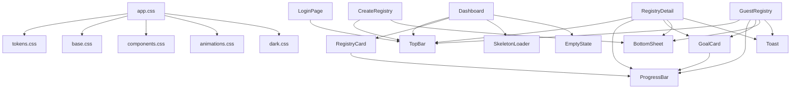

# Design Document: GiftTogether Mobile UI Design System

## Overview

This document specifies the complete technical design for the GiftTogether mobile app UI redesign. The target is Airbnb/Apple/Stripe/Linear-level polish on a .NET MAUI Blazor Hybrid platform (net9.0-android, net9.0-ios, net9.0-maccatalyst, net9.0-windows).

The redesign introduces a unified design system, replaces the existing ad-hoc CSS with a token-driven architecture, and delivers premium micro-interactions across all five screens: LoginPage, Dashboard, RegistryDetail, CreateRegistry, and GuestRegistry.

### Key Design Decisions

- **CSS custom properties as the single source of truth** — all colors, spacing, typography, radii, shadows, and transitions are defined as tokens in `:root`. Dark mode is a pure CSS override via `prefers-color-scheme: dark`. No JavaScript is needed for theming.
- **Inter font via Google Fonts CDN in `index.html`** — MAUI Blazor Hybrid renders in a native WebView; the CDN link in `index.html` loads Inter at app startup. A local `.ttf` fallback is registered via `MauiFont` for offline scenarios.
- **CSS keyframes for all animations** — transitions (bottom sheet, toast, skeleton shimmer, progress bar, page slide) are pure CSS. JavaScript interop (`IJSRuntime`) is used only for imperative operations: clipboard, WhatsApp share, scroll-position reading for parallax, and confetti.
- **Safe area via CSS `env()` variables** — `viewport-fit=cover` is already set in `index.html`. All fixed/sticky elements use `padding-top: env(safe-area-inset-top)` etc.
- **Shared Razor components** — `TopBar`, `BottomSheet`, `Toast`, `SkeletonLoader`, `ProgressBar`, `GoalCard`, `RegistryCard`, and `EmptyState` are extracted into `Components/Shared/` to eliminate duplication across pages.

---

## Architecture

### File Structure

```
GiftTogether.Mobile/
├── wwwroot/
│   ├── index.html                        # Inter font link, JS interop helpers
│   └── css/
│       ├── tokens.css                    # Design tokens (:root custom properties)
│       ├── base.css                      # Reset, html/body, typography utilities
│       ├── components.css                # Shared component styles
│       ├── animations.css                # All @keyframes and transition utilities
│       ├── dark.css                      # prefers-color-scheme: dark overrides
│       └── app.css                       # Entry point: @import all above
├── Components/
│   ├── Shared/
│   │   ├── TopBar.razor                  # Sticky navigation header
│   │   ├── BottomSheet.razor             # Slide-up modal panel
│   │   ├── Toast.razor                   # Auto-dismissing notification
│   │   ├── SkeletonLoader.razor          # Shimmer placeholder
│   │   ├── ProgressBar.razor             # Animated funding progress bar
│   │   ├── GoalCard.razor                # Gift goal card (owner + guest variants)
│   │   ├── RegistryCard.razor            # Registry list card for Dashboard
│   │   └── EmptyState.razor              # Illustrated empty list placeholder
│   ├── Pages/
│   │   ├── LoginPage.razor
│   │   ├── Dashboard.razor
│   │   ├── RegistryDetail.razor
│   │   ├── CreateRegistry.razor
│   │   └── GuestRegistry.razor
│   ├── Layout/
│   │   ├── MainLayout.razor
│   │   └── MainLayout.razor.css
│   ├── Routes.razor
│   └── _Imports.razor
├── Resources/
│   └── Fonts/
│       ├── Inter-Regular.ttf             # Offline fallback
│       ├── Inter-Medium.ttf
│       ├── Inter-SemiBold.ttf
│       └── Inter-Bold.ttf
└── MauiProgram.cs                        # Register Inter fonts
```

### Dependency Graph



### CSS Architecture

The existing `app.css` is split into five focused files imported by a new `app.css` entry point. This separation makes the design system auditable and allows dark mode to be a single isolated file.

```css
/* app.css — entry point only */
@import 'tokens.css';
@import 'base.css';
@import 'components.css';
@import 'animations.css';
@import 'dark.css';
```

### Inter Font Loading Strategy

MAUI Blazor Hybrid runs inside a native `BlazorWebView`. The WebView has internet access, so Google Fonts CDN works identically to a web app. The font is loaded in `index.html` with `display=swap` to prevent FOIT:

```html
<link rel="preconnect" href="https://fonts.googleapis.com" />
<link rel="preconnect" href="https://fonts.gstatic.com" crossorigin />
<link href="https://fonts.googleapis.com/css2?family=Inter:wght@400;500;600;700;800&display=swap" rel="stylesheet" />
```

For offline resilience, Inter `.ttf` files are placed in `Resources/Fonts/` and registered in `MauiProgram.cs`:

```csharp
.ConfigureFonts(fonts =>
{
    fonts.AddFont("Inter-Regular.ttf", "InterRegular");
    fonts.AddFont("Inter-Medium.ttf", "InterMedium");
    fonts.AddFont("Inter-SemiBold.ttf", "InterSemiBold");
    fonts.AddFont("Inter-Bold.ttf", "InterBold");
})
```

The CSS `font-family` declaration uses Inter first with system-ui as fallback:

```css
font-family: 'Inter', system-ui, -apple-system, BlinkMacSystemFont, 'Segoe UI', sans-serif;
```

---

## Components and Interfaces

### Design Token File: `tokens.css`

```css
:root {
  /* ── Color Palette ─────────────────────────────────────────────────────── */
  --color-primary:          #6c63ff;
  --color-primary-dark:     #574fd6;
  --color-primary-light:    #ede9fe;
  --color-surface:          #ffffff;
  --color-surface-raised:   #f8f7ff;
  --color-background:       #f4f3ff;
  --color-text-primary:     #1e1b4b;
  --color-text-secondary:   #6b7280;
  --color-text-disabled:    #9ca3af;
  --color-border:           #e5e7eb;
  --color-success:          #22c55e;
  --color-success-bg:       #dcfce7;
  --color-success-text:     #166534;
  --color-danger:           #ef4444;
  --color-danger-bg:        #fee2e2;
  --color-danger-text:      #991b1b;
  --color-warning:          #f59e0b;
  --color-warning-bg:       #fffbeb;
  --color-warning-text:     #92400e;
  --color-info-bg:          #f0f9ff;
  --color-info-text:        #0c4a6e;
  --color-whatsapp:         #25d366;

  /* ── Typography Scale ──────────────────────────────────────────────────── */
  --text-xs:    0.75rem;   /* 12px */
  --text-sm:    0.8125rem; /* 13px */
  --text-base:  1rem;      /* 16px */
  --text-lg:    1.125rem;  /* 18px */
  --text-xl:    1.25rem;   /* 20px */
  --text-2xl:   1.5rem;    /* 24px */
  --text-3xl:   1.875rem;  /* 30px */
  --text-4xl:   2.25rem;   /* 36px */

  --weight-regular:   400;
  --weight-medium:    500;
  --weight-semibold:  600;
  --weight-bold:      700;
  --weight-extrabold: 800;

  --leading-tight:   1.2;
  --leading-normal:  1.5;
  --leading-relaxed: 1.65;

  /* ── Spacing (4px base unit) ───────────────────────────────────────────── */
  --space-1:   0.25rem;  /* 4px  */
  --space-2:   0.5rem;   /* 8px  */
  --space-3:   0.75rem;  /* 12px */
  --space-4:   1rem;     /* 16px */
  --space-5:   1.25rem;  /* 20px */
  --space-6:   1.5rem;   /* 24px */
  --space-7:   1.75rem;  /* 28px */
  --space-8:   2rem;     /* 32px */
  --space-9:   2.25rem;  /* 36px */
  --space-10:  2.5rem;   /* 40px */
  --space-11:  2.75rem;  /* 44px */
  --space-12:  3rem;     /* 48px */
  --space-13:  3.25rem;  /* 52px */
  --space-14:  3.5rem;   /* 56px */
  --space-15:  3.75rem;  /* 60px */
  --space-16:  4rem;     /* 64px */

  /* ── Border Radius ─────────────────────────────────────────────────────── */
  --radius-sm:   6px;
  --radius-md:   10px;
  --radius-lg:   14px;
  --radius-xl:   20px;
  --radius-full: 9999px;

  /* ── Transitions ───────────────────────────────────────────────────────── */
  --transition-fast:   150ms cubic-bezier(0.4, 0, 0.2, 1);
  --transition-base:   250ms cubic-bezier(0.4, 0, 0.2, 1);
  --transition-slow:   400ms cubic-bezier(0.4, 0, 0.2, 1);
  --transition-spring: 300ms cubic-bezier(0.34, 1.56, 0.64, 1);

  /* ── Elevation (Box Shadows) ───────────────────────────────────────────── */
  --shadow-sm:  0 1px 3px rgba(0,0,0,0.08), 0 1px 2px rgba(0,0,0,0.06);
  --shadow-md:  0 4px 12px rgba(108,99,255,0.10), 0 2px 4px rgba(0,0,0,0.06);
  --shadow-lg:  0 10px 30px rgba(108,99,255,0.15), 0 4px 8px rgba(0,0,0,0.08);
  --shadow-xl:  0 20px 50px rgba(108,99,255,0.20), 0 8px 16px rgba(0,0,0,0.10);
}
```

### Dark Mode Token Overrides: `dark.css`

```css
@media (prefers-color-scheme: dark) {
  :root {
    --color-primary:          #7c74ff;
    --color-primary-dark:     #6c63ff;
    --color-primary-light:    #2d2a5e;
    --color-surface:          #1c1b2e;
    --color-surface-raised:   #252440;
    --color-background:       #13121f;
    --color-text-primary:     #f0eeff;
    --color-text-secondary:   #9ca3af;
    --color-text-disabled:    #6b7280;
    --color-border:           #2d2a5e;
    --color-success:          #4ade80;
    --color-success-bg:       #14532d;
    --color-success-text:     #bbf7d0;
    --color-danger:           #f87171;
    --color-danger-bg:        #7f1d1d;
    --color-danger-text:      #fecaca;
    --color-warning:          #fbbf24;
    --color-warning-bg:       #78350f;
    --color-warning-text:     #fde68a;
    --color-info-bg:          #0c2340;
    --color-info-text:        #bae6fd;
    --shadow-sm:  0 1px 3px rgba(0,0,0,0.30), 0 1px 2px rgba(0,0,0,0.20);
    --shadow-md:  0 4px 12px rgba(0,0,0,0.40), 0 2px 4px rgba(0,0,0,0.20);
    --shadow-lg:  0 10px 30px rgba(0,0,0,0.50), 0 4px 8px rgba(0,0,0,0.30);
  }
}

/* Reduced motion: disable all non-essential animations */
@media (prefers-reduced-motion: reduce) {
  *, *::before, *::after {
    animation-duration: 0.01ms !important;
    animation-iteration-count: 1 !important;
    transition-duration: 0.01ms !important;
  }
}
```

### Shared Component: `TopBar.razor`

```razor
@* Parameters:
   Title (string): centered title text
   ShowBack (bool): show back chevron on left
   OnBack (EventCallback): back button handler
   RightContent (RenderFragment?): right slot for action buttons
*@
<header class="top-bar" role="banner">
    <div class="top-bar-left">
        @if (ShowBack)
        {
            <button class="top-bar-back" @onclick="OnBack" aria-label="Go back">
                <svg width="24" height="24" viewBox="0 0 24 24" fill="none" aria-hidden="true">
                    <path d="M15 18l-6-6 6-6" stroke="currentColor" stroke-width="2"
                          stroke-linecap="round" stroke-linejoin="round"/>
                </svg>
            </button>
        }
        else
        {
            <span class="top-bar-brand" aria-label="GiftTogether">
                <svg class="top-bar-logo" .../>
                <span>GiftTogether</span>
            </span>
        }
    </div>
    @if (!string.IsNullOrEmpty(Title))
    {
        <h1 class="top-bar-title">@Title</h1>
    }
    <div class="top-bar-right">
        @RightContent
    </div>
</header>

@code {
    [Parameter] public string Title { get; set; } = "";
    [Parameter] public bool ShowBack { get; set; }
    [Parameter] public EventCallback OnBack { get; set; }
    [Parameter] public RenderFragment? RightContent { get; set; }
}
```

CSS for `TopBar`:
```css
.top-bar {
  background: var(--color-surface);
  border-bottom: 1px solid var(--color-border);
  padding: var(--space-3) var(--space-4);
  padding-top: calc(var(--space-3) + env(safe-area-inset-top));
  display: grid;
  grid-template-columns: 60px 1fr 60px;
  align-items: center;
  position: sticky;
  top: 0;
  z-index: 50;
  box-shadow: var(--shadow-sm);
}
.top-bar-title {
  font-size: var(--text-base);
  font-weight: var(--weight-semibold);
  text-align: center;
  white-space: nowrap;
  overflow: hidden;
  text-overflow: ellipsis;
  color: var(--color-text-primary);
}
.top-bar-back {
  display: flex;
  align-items: center;
  justify-content: center;
  width: 44px;
  height: 44px;
  border: none;
  background: none;
  color: var(--color-primary);
  cursor: pointer;
  border-radius: var(--radius-full);
  transition: background var(--transition-fast);
}
.top-bar-back:active { background: var(--color-primary-light); }
.top-bar-brand {
  display: flex;
  align-items: center;
  gap: var(--space-2);
  font-size: var(--text-lg);
  font-weight: var(--weight-extrabold);
  color: var(--color-primary);
}
.top-bar-right {
  display: flex;
  align-items: center;
  justify-content: flex-end;
  gap: var(--space-2);
}
```

### Shared Component: `BottomSheet.razor`

```razor
@* Parameters:
   IsOpen (bool): controls visibility
   OnClose (EventCallback): backdrop/handle tap handler
   Title (string): sheet heading
   ChildContent (RenderFragment): form content
*@
@if (IsOpen)
{
    <div class="sheet-backdrop @(IsOpen ? "sheet-backdrop--visible" : "")"
         @onclick="OnClose" role="dialog" aria-modal="true" aria-label="@Title">
        <div class="sheet @(IsOpen ? "sheet--open" : "")" @onclick:stopPropagation>
            <div class="sheet-handle" aria-hidden="true"></div>
            @if (!string.IsNullOrEmpty(Title))
            {
                <h2 class="sheet-title">@Title</h2>
            }
            <div class="sheet-body">
                @ChildContent
            </div>
        </div>
    </div>
}

@code {
    [Parameter] public bool IsOpen { get; set; }
    [Parameter] public EventCallback OnClose { get; set; }
    [Parameter] public string Title { get; set; } = "";
    [Parameter] public RenderFragment? ChildContent { get; set; }
}
```

CSS for `BottomSheet`:
```css
.sheet-backdrop {
  position: fixed;
  inset: 0;
  background: rgba(0, 0, 0, 0);
  display: flex;
  align-items: flex-end;
  justify-content: center;
  z-index: 100;
  transition: background var(--transition-base);
}
.sheet-backdrop--visible { background: rgba(0, 0, 0, 0.5); }

.sheet {
  background: var(--color-surface);
  width: 100%;
  max-width: 600px;
  border-radius: var(--radius-xl) var(--radius-xl) 0 0;
  padding: var(--space-5) var(--space-5);
  padding-bottom: calc(var(--space-8) + env(safe-area-inset-bottom));
  max-height: 90vh;
  overflow-y: auto;
  transform: translateY(100%);
  transition: transform var(--transition-spring);
  box-shadow: var(--shadow-xl);
}
.sheet--open { transform: translateY(0); }

.sheet-handle {
  width: 40px;
  height: 4px;
  background: var(--color-border);
  border-radius: var(--radius-full);
  margin: 0 auto var(--space-5);
}
.sheet-title {
  font-size: var(--text-xl);
  font-weight: var(--weight-bold);
  color: var(--color-text-primary);
  margin-bottom: var(--space-5);
}
```

### Shared Component: `Toast.razor`

```razor
@* Triggered by calling Show(message, type) from parent pages *@
@if (_visible)
{
    <div class="toast toast--@_type @(_entering ? "toast--enter" : "toast--exit")"
         role="status" aria-live="polite">
        <span class="toast-icon" aria-hidden="true">@GetIcon()</span>
        <span class="toast-message">@_message</span>
    </div>
}

@code {
    bool _visible;
    bool _entering;
    string _message = "";
    string _type = "success"; // success | error | info

    public async Task Show(string message, string type = "success")
    {
        _message = message;
        _type = type;
        _visible = true;
        _entering = true;
        StateHasChanged();
        await Task.Delay(2800);
        _entering = false;
        StateHasChanged();
        await Task.Delay(200);
        _visible = false;
        StateHasChanged();
    }

    string GetIcon() => _type switch
    {
        "success" => "✓",
        "error"   => "✕",
        _         => "ℹ"
    };
}
```

CSS for `Toast`:
```css
.toast {
  position: fixed;
  bottom: calc(var(--space-6) + env(safe-area-inset-bottom));
  left: 50%;
  transform: translateX(-50%) translateY(120%);
  background: var(--color-text-primary);
  color: var(--color-surface);
  padding: var(--space-3) var(--space-5);
  border-radius: var(--radius-full);
  font-size: var(--text-sm);
  font-weight: var(--weight-semibold);
  display: flex;
  align-items: center;
  gap: var(--space-2);
  z-index: 200;
  box-shadow: var(--shadow-lg);
  white-space: nowrap;
  transition: transform var(--transition-spring), opacity var(--transition-base);
}
.toast--enter { transform: translateX(-50%) translateY(0); opacity: 1; }
.toast--exit  { transform: translateX(-50%) translateY(120%); opacity: 0; }
.toast--success .toast-icon { color: var(--color-success); }
.toast--error   .toast-icon { color: var(--color-danger); }
```

### Shared Component: `SkeletonLoader.razor`

```razor
@* Parameters:
   Variant ("registry-card" | "goal-card" | "hero" | "text"): shape preset
   Count (int): number of skeleton items to render
*@
@for (int i = 0; i < Count; i++)
{
    <div class="skeleton skeleton--@Variant" aria-hidden="true">
        @if (Variant == "registry-card")
        {
            <div class="skeleton-line skeleton-line--title"></div>
            <div class="skeleton-line skeleton-line--meta"></div>
            <div class="skeleton-line skeleton-line--bar"></div>
        }
        else if (Variant == "goal-card")
        {
            <div class="skeleton-image"></div>
            <div class="skeleton-body">
                <div class="skeleton-line skeleton-line--title"></div>
                <div class="skeleton-line skeleton-line--meta"></div>
                <div class="skeleton-line skeleton-line--bar"></div>
            </div>
        }
    </div>
}

@code {
    [Parameter] public string Variant { get; set; } = "registry-card";
    [Parameter] public int Count { get; set; } = 3;
}
```

CSS for `SkeletonLoader`:
```css
@keyframes shimmer {
  0%   { background-position: -200% 0; }
  100% { background-position:  200% 0; }
}

.skeleton-line,
.skeleton-image,
.skeleton-body > * {
  background: linear-gradient(
    90deg,
    var(--color-border) 25%,
    var(--color-surface-raised) 50%,
    var(--color-border) 75%
  );
  background-size: 200% 100%;
  animation: shimmer 1.5s ease-in-out infinite;
  border-radius: var(--radius-sm);
}

.skeleton--registry-card {
  background: var(--color-surface);
  border-radius: var(--radius-lg);
  padding: var(--space-4) var(--space-5);
  margin-bottom: var(--space-3);
  box-shadow: var(--shadow-sm);
}
.skeleton-line--title { height: 18px; width: 60%; margin-bottom: var(--space-2); }
.skeleton-line--meta  { height: 13px; width: 40%; margin-bottom: var(--space-3); }
.skeleton-line--bar   { height: 8px;  width: 100%; border-radius: var(--radius-full); }

.skeleton--goal-card {
  background: var(--color-surface);
  border-radius: var(--radius-lg);
  overflow: hidden;
  margin-bottom: var(--space-4);
  box-shadow: var(--shadow-sm);
}
.skeleton-image { height: 180px; width: 100%; border-radius: 0; }
.skeleton-body  { padding: var(--space-4); }
```

### Shared Component: `ProgressBar.razor`

```razor
@* Parameters:
   Value (decimal): 0–100 percentage
   Height (string): CSS height value, default "10px"
   Animated (bool): whether to animate width changes
*@
<div class="progress-track" role="progressbar"
     aria-valuenow="@((int)Value" aria-valuemin="0" aria-valuemax="100"
     aria-label="@((int)Value)% funded">
    <div class="progress-fill @(Animated ? "progress-fill--animated" : "")"
         style="width: @(Math.Min(100, Value))%; height: @Height;">
    </div>
</div>

@code {
    [Parameter] public decimal Value { get; set; }
    [Parameter] public string Height { get; set; } = "10px";
    [Parameter] public bool Animated { get; set; } = true;
}
```

CSS for `ProgressBar`:
```css
.progress-track {
  background: var(--color-primary-light);
  border-radius: var(--radius-full);
  overflow: hidden;
  height: 10px;
}
.progress-fill {
  height: 100%;
  background: linear-gradient(90deg, var(--color-primary), var(--color-success));
  border-radius: var(--radius-full);
}
.progress-fill--animated {
  transition: width 600ms cubic-bezier(0.0, 0, 0.2, 1);
}
```

### Shared Component: `GoalCard.razor`

```razor
@* Parameters:
   Goal (GiftGoalResponse): the goal data
   IsOwner (bool): shows Remove button instead of Contribute
   OnContribute (EventCallback<GiftGoalResponse>): guest contribute tap
   OnRemove (EventCallback<GiftGoalResponse>): owner remove tap
*@
<article class="goal-card @(IsFunded ? "goal-card--funded" : "")">
    @if (!string.IsNullOrEmpty(Goal.ImageUrl))
    {
        
    }
    else
    {
        <div class="goal-card-image-placeholder" aria-hidden="true">🎁</div>
    }
    <div class="goal-card-body">
        <div class="goal-card-header">
            <h3 class="goal-card-name">@Goal.Name</h3>
            <span class="badge badge--primary">R @Goal.TargetAmount.ToString("N0")</span>
        </div>
        @if (!string.IsNullOrEmpty(Goal.ProductLink))
        {
            <a class="goal-card-link" href="@Goal.ProductLink" target="_blank" rel="noopener">
                View product ↗
            </a>
        }
        @if (!string.IsNullOrEmpty(Goal.Description))
        {
            <p class="goal-card-desc">@Goal.Description</p>
        }
        <ProgressBar Value="@FundedPct" />
        <div class="goal-card-amounts">
            <span><strong>R @Goal.TotalRaised.ToString("N0")</strong> raised</span>
            <span>@((int)FundedPct)%</span>
        </div>
    </div>
    <div class="goal-card-actions">
        @if (IsFunded)
        {
            <div class="funded-badge" role="status">
                <svg .../>
                Fully funded
            </div>
        }
        else if (IsOwner)
        {
            <button class="btn btn--ghost btn--danger btn--sm" @onclick="() => OnRemove.InvokeAsync(Goal)">
                Remove goal
            </button>
        }
        else
        {
            <button class="btn btn--primary" @onclick="() => OnContribute.InvokeAsync(Goal)">
                🎁 Contribute
            </button>
        }
    </div>
    <div class="goal-card-contribs">
        <!-- contributor list, max 3 shown -->
    </div>
</article>

@code {
    [Parameter, EditorRequired] public GiftGoalResponse Goal { get; set; } = default!;
    [Parameter] public bool IsOwner { get; set; }
    [Parameter] public EventCallback<GiftGoalResponse> OnContribute { get; set; }
    [Parameter] public EventCallback<GiftGoalResponse> OnRemove { get; set; }

    decimal FundedPct => Goal.TargetAmount > 0
        ? Math.Min(100, Math.Round(Goal.TotalRaised / Goal.TargetAmount * 100, 1))
        : 0;
    bool IsFunded => FundedPct >= 100;
}
```

### Shared Component: `RegistryCard.razor`

```razor
<article class="registry-card @(IsFunded ? "registry-card--funded" : "")"
         @onclick="OnTap" role="button" tabindex="0"
         aria-label="@Registry.Name, @((int)FundedPct)% funded">
    <div class="registry-card-thumb" style="@ThumbStyle" aria-hidden="true">
        @if (string.IsNullOrEmpty(Registry.HeroImageUrl))
        {
            <span class="registry-card-initial">@(Registry.Name.Length > 0 ? Registry.Name[0] : '?')</span>
        }
    </div>
    <div class="registry-card-info">
        <div class="registry-card-name">@Registry.Name</div>
        <div class="registry-card-meta">
            @Registry.GiftGoals.Count goal@(Registry.GiftGoals.Count != 1 ? "s" : "")
            · R @TotalRaised.ToString("N0") raised
        </div>
        <ProgressBar Value="@FundedPct" Height="6px" />
        @if (IsFunded)
        {
            <span class="badge badge--success" role="status">✓ Fully funded</span>
        }
    </div>
    <svg class="registry-card-chevron" .../>
</article>

@code {
    [Parameter, EditorRequired] public RegistryResponse Registry { get; set; } = default!;
    [Parameter] public EventCallback OnTap { get; set; }

    decimal TotalRaised => Registry.GiftGoals.Sum(g => g.TotalRaised);
    decimal TotalTarget => Registry.GiftGoals.Sum(g => g.TargetAmount);
    decimal FundedPct   => TotalTarget > 0 ? Math.Min(100, Math.Round(TotalRaised / TotalTarget * 100, 1)) : 0;
    bool    IsFunded    => FundedPct >= 100;

    string ThumbStyle => !string.IsNullOrEmpty(Registry.HeroImageUrl)
        ? $"background-image: url('{Registry.HeroImageUrl}'); background-size: cover; background-position: center;"
        : $"background: {GetGradient(Registry.Name)};";

    static string GetGradient(string name)
    {
        // Deterministic gradient from name hash
        var hue = Math.Abs(name.GetHashCode()) % 360;
        return $"linear-gradient(135deg, hsl({hue},70%,60%), hsl({(hue + 40) % 360},70%,50%))";
    }
}
```

### Shared Component: `EmptyState.razor`

```razor
<div class="empty-state" role="status">
    <div class="empty-state-illustration" aria-hidden="true">@Icon</div>
    <h2 class="empty-state-title">@Title</h2>
    <p class="empty-state-body">@Body</p>
    @if (ActionContent != null)
    {
        <div class="empty-state-action">@ActionContent</div>
    }
</div>

@code {
    [Parameter] public string Icon { get; set; } = "🎁";
    [Parameter] public string Title { get; set; } = "";
    [Parameter] public string Body { get; set; } = "";
    [Parameter] public RenderFragment? ActionContent { get; set; }
}
```

---

## Data Models

The existing DTOs in `ApiService.cs` are sufficient. No new data models are required for the UI layer. The design system operates entirely on the existing `RegistryResponse`, `GiftGoalResponse`, and `ContributionResponse` records.

### UI State Models

Each page manages local UI state via C# fields. The following patterns are standardized:

```csharp
// Standard page state pattern
bool _loading = true;          // initial data load → shows SkeletonLoader
bool _actionLoading = false;   // in-flight mutation → disables action button
string? _error = null;         // network/API error → shows inline error + retry
string? _toastMessage = null;  // success feedback → triggers Toast component
```

### Greeting Logic (Dashboard)

```csharp
static string GetGreeting(string? fullName, DateTime now)
{
    var firstName = fullName?.Split(' ').FirstOrDefault() ?? "there";
    var salutation = now.Hour switch
    {
        >= 5  and < 12 => "Good morning",
        >= 12 and < 17 => "Good afternoon",
        _              => "Good evening"
    };
    return $"{salutation}, {firstName}";
}
```

### Aggregate Stats (Dashboard)

```csharp
static (int count, int aggregatePct) ComputeStats(List<RegistryResponse> registries)
{
    var count = registries.Count;
    var totalRaised = registries.SelectMany(r => r.GiftGoals).Sum(g => g.TotalRaised);
    var totalTarget = registries.SelectMany(r => r.GiftGoals).Sum(g => g.TargetAmount);
    var pct = totalTarget > 0 ? (int)Math.Min(100, Math.Round(totalRaised / totalTarget * 100)) : 0;
    return (count, pct);
}
```

### Funding Percentage (shared utility)

```csharp
static int FundingPct(decimal raised, decimal target) =>
    target > 0 ? (int)Math.Min(100, Math.Round(raised / target * 100)) : 0;
```

---

## Screen-by-Screen Design

### LoginPage

**Layout:** Full-screen gradient background (`--color-primary` → `--color-primary-dark` at 160°). A soft radial glow (white, 30% opacity, 400px radius) is positioned at the top-center using a `::before` pseudo-element to add depth without motion.

**Brand section:** Centered in the upper 35% of the screen. Gift icon (SVG, 56px), wordmark (Inter 800, `--text-3xl`), tagline (Inter 400, `--text-sm`, 80% opacity).

**Auth card:** Positioned in the lower 65%, `--radius-xl` corners, `--shadow-lg`, white background. Slides up from `translateY(40px)` with `opacity: 0` to resting position on mount (300ms spring).

**Mode switching:** The card content fades out (`opacity: 0`, 150ms) then fades in with the new form (`opacity: 1`, 150ms). A CSS class `.form-mode--exit` / `.form-mode--enter` controls this.

**Input focus:** `border-color` transitions to `--color-primary` in `--transition-fast`. A subtle `box-shadow: 0 0 0 3px var(--color-primary-light)` focus ring appears.

**Loading button state:** The button text is replaced with a 20px inline spinner (CSS `@keyframes spin`). The button is `disabled` and `opacity: 0.7`.

**Error banner:** Slides down from `translateY(-8px)` with `opacity: 0` to resting position. Background `--color-danger-bg`, text `--color-danger-text`, left border 3px `--color-danger`. Includes an ✕ dismiss button (44×44 touch target).

**Field-level errors:** Appear below the relevant input in `--text-xs`, `--color-danger-text`, with a small ⚠ icon prefix.

```
┌─────────────────────────────────┐
│  [gradient bg + radial glow]    │
│                                 │
│         🎁 GiftTogether         │
│    Group gifting, done right.   │
│                                 │
│  ┌───────────────────────────┐  │
│  │  Welcome back             │  │
│  │  [error banner if any]    │  │
│  │  Email ________________   │  │
│  │  Password _____________   │  │
│  │  [Log in button]          │  │
│  │  No account? Create one   │  │
│  └───────────────────────────┘  │
└─────────────────────────────────┘
```

### Dashboard

**Top bar:** Brand mark left, user initials avatar button right (44×44, circular, `--color-primary-light` background, `--color-primary` text). Avatar tap opens a small popover with "Log out".

**Greeting + stats row:** Below top bar, full-width. Left: greeting text (Inter 800, `--text-2xl`) + time-of-day salutation. Right: stat pill showing "N registries · X% funded" (Inter 600, `--text-sm`, `--color-primary-light` background).

**Skeleton state:** Three `SkeletonLoader` components with `variant="registry-card"` render while `_loading` is true.

**Empty state:** `EmptyState` component with gift icon, "No registries yet" title, supporting copy, and a full-width "Create your first registry" primary button.

**Registry list:** Each `RegistryCard` has a 64×64 thumbnail (left), info column (flex-1), and chevron (right). Cards have `--shadow-sm`, `--radius-lg`, 12px bottom margin. Tap triggers `scale(0.98)` press feedback in `--transition-fast`.

**FAB:** A circular `+` button (56×56) fixed at bottom-right, `--color-primary` background, `--shadow-lg`, `bottom: calc(var(--space-6) + env(safe-area-inset-bottom))`. Navigates to `/create`.

```
┌─────────────────────────────────┐
│ 🎁 GiftTogether          [J.S.] │  ← TopBar
├─────────────────────────────────┤
│ Good morning, Jane              │
│ 3 registries · 42% funded       │
│                                 │
│ ┌─────────────────────────────┐ │
│ │ [thumb] Baby Shower    ›    │ │  ← RegistryCard
│ │         3 goals · R 4,500   │ │
│ │         ████░░░░░░ 45%      │ │
│ └─────────────────────────────┘ │
│ ┌─────────────────────────────┐ │
│ │ [thumb] Wedding        ›    │ │
│ │         5 goals · R 12,000  │ │
│ │         ██████████ ✓ Funded │ │
│ └─────────────────────────────┘ │
│                          [+]    │  ← FAB
└─────────────────────────────────┘
```

### RegistryDetail

**Hero section:** Full-bleed, `min-height: 220px`, `max-height: 320px`. Background is the registry hero image with a `linear-gradient(to bottom, rgba(0,0,0,0.1), rgba(0,0,0,0.6))` scrim overlay. Fallback is a gradient derived from the registry name. Content: owner avatar (80px circle, white border), "Created by" label, owner name, registry title (Inter 800, `--text-3xl`), personal message (italic).

**Parallax:** A JS interop listener on the scroll container reads `scrollTop` and applies `transform: translateY(scrollTop * 0.4px)` to the hero image via a CSS variable `--hero-parallax-offset`. This is attached in `OnAfterRenderAsync`.

**Progress card:** `--color-surface` background, `--radius-xl`, `--shadow-lg`, `margin-top: -24px`, `position: relative`, `z-index: 2`, `margin: 0 var(--space-4)`. Contains: raised amount (Inter 800, `--text-2xl`), target amount, `ProgressBar`, percentage + goal count row, share buttons row.

**Goal cards:** `GoalCard` components with `IsOwner=true`. Each card has a remove button (ghost, danger color, 44px touch target).

**Add goal bottom sheet:** `BottomSheet` with title "Add a gift goal". Form fields: name, description, target amount, product link. Spring animation on open (300ms), ease-out on close (200ms).

**Success toast:** After adding a goal, `Toast.Show("✓ Goal added!")` is called. The bottom sheet closes simultaneously.

**Top bar:** Back chevron (left), registry name truncated with ellipsis (center), "+ Goal" text button (right, `--color-primary`, 44px touch target).

### CreateRegistry

**Step indicator:** Two segments at the top of the content area (below top bar). Active segment is `--color-primary`, inactive is `--color-border`. Each segment is 4px tall, `--radius-full`. Animated: active segment fills from left using `width` transition.

**Step 1 — Registry details:**
- Registry name input (required)
- Description textarea (optional)
- "Continue →" primary button

**Step 2 — Add gift goals:**
- Horizontal slide-in animation: step 1 slides out to `translateX(-100%)`, step 2 slides in from `translateX(100%)`, both over 300ms with `cubic-bezier(0.4, 0, 0.2, 1)`.
- Gift name, description, target amount, product link inputs
- "Add goal" primary button + "Done" outline button (side by side)
- Added goals list below the form: each goal appends with a `slideInUp` animation (200ms)

**Field validation:** On submit attempt, empty required fields get `border-color: var(--color-danger)` and a `--text-xs` error message below them. The border transitions back to `--color-border` when the user starts typing.

**Top bar:** Back button (left), step title centered ("Registry details" / "Add gift goals").

### GuestRegistry

**Hero section:** Identical visual treatment to RegistryDetail. No parallax (guest view is simpler).

**Trust banners:** Two info banners below the progress card:
- Amber banner: `--color-warning-bg` background, `--color-warning-text` text, amber left border, ⚠ icon + "Only contribute if you personally know [name]."
- Blue banner: `--color-info-bg` background, `--color-info-text` text, blue left border, 🧪 icon + "Test mode: No real payments are processed."

**Goal cards:** `GoalCard` components with `IsOwner=false`. Funded goals have `opacity: 0.7` and a green success overlay badge.

**Contribution bottom sheet:** Fields: contributor name (optional), amount (required), message (optional). Submit button: "Contribute (test)". Disclaimer text below button.

**Success state:** After successful contribution, the sheet content is replaced with a centered success view: 🎉 emoji (64px), "Thank you!" heading, supporting copy, "Close" button. A CSS confetti animation (`@keyframes confettiFall`) plays for 2 seconds using 12 pseudo-randomly positioned `::before`/`::after` elements on the success container.

**Top bar:** Brand mark only, no back button, no authenticated actions.

---

## Animation and Transition Implementation

### Page Transitions

Page navigation uses a CSS class applied to the `<div class="page">` wrapper in `MainLayout.razor`. The `NavigationManager.LocationChanged` event triggers the animation:

```csharp
// MainLayout.razor
protected override void OnInitialized()
{
    Nav.LocationChanged += OnLocationChanged;
}

void OnLocationChanged(object? sender, LocationChangedEventArgs e)
{
    _transitioning = true;
    _direction = e.IsNavigationIntercepted ? "forward" : "back";
    StateHasChanged();
    _ = Task.Delay(300).ContinueWith(_ =>
    {
        _transitioning = false;
        InvokeAsync(StateHasChanged);
    });
}
```

```css
@keyframes slideInRight {
  from { transform: translateX(100%); opacity: 0; }
  to   { transform: translateX(0);    opacity: 1; }
}
@keyframes slideInLeft {
  from { transform: translateX(-100%); opacity: 0; }
  to   { transform: translateX(0);     opacity: 1; }
}
.page--enter-forward { animation: slideInRight 300ms cubic-bezier(0.4, 0, 0.2, 1) both; }
.page--enter-back    { animation: slideInLeft  300ms cubic-bezier(0.4, 0, 0.2, 1) both; }
```

### Bottom Sheet Spring Animation

The spring easing `cubic-bezier(0.34, 1.56, 0.64, 1)` produces a slight overshoot that mimics native iOS sheet behavior. The `--transition-spring` token is used for the open transition; close uses `--transition-base` (no overshoot, faster).

### Toast Auto-Dismiss

The `Toast` component manages its own lifecycle. The 3-second display window is split: 2800ms visible, then 200ms fade-out transition, then `_visible = false` removes the DOM element.

### Skeleton Shimmer

The `shimmer` keyframe sweeps a gradient from left to right over 1.5 seconds using `background-position` animation. The gradient uses `--color-border` (dark end) and `--color-surface-raised` (light end) so it adapts automatically to dark mode.

### Press Feedback

All interactive elements (buttons, cards, links) use:
```css
.btn:active,
.registry-card:active,
.goal-card-actions button:active {
  transform: scale(0.96);
  opacity: 0.85;
  transition: transform 80ms ease, opacity 80ms ease;
}
```

### Confetti (GuestRegistry success)

A lightweight CSS-only confetti effect using 12 `<span>` elements generated in the success state. Each span has a random `--confetti-x` and `--confetti-delay` CSS variable set inline, and the `@keyframes confettiFall` animation moves them from `translateY(-20px)` to `translateY(120px)` with rotation.

```css
@keyframes confettiFall {
  0%   { transform: translateY(-20px) rotate(0deg);   opacity: 1; }
  100% { transform: translateY(120px) rotate(720deg); opacity: 0; }
}
.confetti-piece {
  position: absolute;
  width: 8px; height: 8px;
  border-radius: 2px;
  animation: confettiFall 1.8s ease-in var(--confetti-delay) both;
  left: var(--confetti-x);
  top: 0;
}
```

### Parallax (RegistryDetail hero)

```javascript
// index.html
window.attachParallax = (elementId, scrollContainerId) => {
    const el = document.getElementById(elementId);
    const container = document.getElementById(scrollContainerId) || window;
    const handler = () => {
        const scrollTop = container.scrollTop ?? window.scrollY;
        el.style.setProperty('--hero-parallax-offset', `${scrollTop * 0.4}px`);
    };
    container.addEventListener('scroll', handler, { passive: true });
    return { dispose: () => container.removeEventListener('scroll', handler) };
};
```

```css
.registry-hero-image {
  transform: translateY(var(--hero-parallax-offset, 0));
  will-change: transform;
}
```

---

## Dark Mode Implementation

Dark mode is entirely CSS-driven. The `prefers-color-scheme: dark` media query in `dark.css` overrides the color tokens defined in `tokens.css`. Because all component styles reference tokens (e.g., `background: var(--color-surface)`), they automatically adapt.

Key dark mode considerations:
- **Shadows** use higher opacity black (not purple-tinted) since dark surfaces don't benefit from colored shadows.
- **Progress bar track** uses `--color-primary-light` which in dark mode is `#2d2a5e` — dark enough to contrast with the fill.
- **Skeleton shimmer** gradient endpoints (`--color-border` and `--color-surface-raised`) are both dark in dark mode, producing a subtle shimmer rather than a harsh contrast.
- **Hero gradient scrim** is unchanged — it's always a dark overlay on the hero image.
- **Auth card** background uses `--color-surface` which becomes `#1c1b2e` in dark mode.

No JavaScript is needed to detect or toggle dark mode. The WebView inherits the system preference automatically.

---

## Safe Area and Accessibility Implementation

### Safe Area

`viewport-fit=cover` is already set in `index.html`. The following elements receive safe area padding:

| Element | CSS |
|---|---|
| `.top-bar` | `padding-top: calc(var(--space-3) + env(safe-area-inset-top))` |
| `.sheet` (BottomSheet) | `padding-bottom: calc(var(--space-8) + env(safe-area-inset-bottom))` |
| `.toast` | `bottom: calc(var(--space-6) + env(safe-area-inset-bottom))` |
| `.fab` (Dashboard FAB) | `bottom: calc(var(--space-6) + env(safe-area-inset-bottom))` |
| `.auth-screen` | `padding-top: env(safe-area-inset-top)` |

### Touch Targets

All interactive elements meet the 44×44pt minimum:
- Buttons: `min-height: 44px`, `min-width: 44px`
- Top bar actions: `width: 44px; height: 44px`
- Form inputs: `padding: var(--space-3) var(--space-4)` → ~48px height at default font size
- Card tap areas: full card width, `min-height: 64px`

### ARIA and Semantic HTML

- `TopBar` uses `<header role="banner">`
- `BottomSheet` uses `role="dialog" aria-modal="true" aria-label="..."`
- `ProgressBar` uses `role="progressbar" aria-valuenow aria-valuemin aria-valuemax aria-label`
- `RegistryCard` uses `role="button" tabindex="0"` with `aria-label` including name and funding %
- `GoalCard` uses `<article>` with `<h3>` for goal name
- `EmptyState` uses `role="status"`
- `Toast` uses `role="status" aria-live="polite"`
- Skeleton loaders use `aria-hidden="true"` to hide from screen readers
- All icons that convey meaning have accompanying text labels or `aria-label`

### Focus Management

- Focus ring: `outline: 2px solid var(--color-primary); outline-offset: 2px` on `:focus-visible`
- When a `BottomSheet` opens, focus is moved to the first focusable element inside it
- When a `BottomSheet` closes, focus returns to the trigger element
- Focus trap is implemented in `BottomSheet.razor` using JS interop:

```javascript
window.trapFocus = (sheetId) => {
    const sheet = document.getElementById(sheetId);
    const focusable = sheet.querySelectorAll(
        'button, input, textarea, select, a[href], [tabindex]:not([tabindex="-1"])'
    );
    if (focusable.length) focusable[0].focus();
};
```

### Color Independence

Every color-coded state includes a non-color indicator:
- Error: red color + ⚠ icon + "Error" label
- Success: green color + ✓ icon + "Success" / "Fully funded" text
- Warning: amber color + ⚠ icon + descriptive text
- Loading: spinner animation (not color-only)
- Funded badge: green color + ✓ checkmark + "Fully funded" text

### Dynamic Text Sizing

All font sizes use `rem` units (defined in `tokens.css`). The base font size on `html` is not overridden, so it inherits the device's accessibility font size setting. Layout uses `min-height` rather than fixed `height` to accommodate larger text.

---

## Error Handling

### Network Error Pattern

Each page implements a consistent error recovery pattern:

```razor
@if (_error != null)
{
    <div class="error-state" role="alert">
        <svg class="error-state-icon" aria-hidden="true">...</svg>
        <p class="error-state-message">@_error</p>
        <button class="btn btn--outline" @onclick="RetryAsync">Try again</button>
    </div>
}
```

The `error-state` component is distinct from the `alert` component: it replaces the content area rather than appearing above it, and always includes a retry button.

### Validation Error Pattern

Form validation errors appear inline, below the relevant field:

```css
.form-field--error input,
.form-field--error textarea {
  border-color: var(--color-danger);
  box-shadow: 0 0 0 3px var(--color-danger-bg);
}
.form-field-error-msg {
  display: flex;
  align-items: center;
  gap: var(--space-1);
  font-size: var(--text-xs);
  color: var(--color-danger-text);
  margin-top: var(--space-1);
}
```

### Destructive Action Pattern

Delete confirmations in `BottomSheet` disable all interactive elements during the request:

```razor
<button class="btn btn--danger" @onclick="ConfirmDelete" disabled="@_loading">
    @if (_loading) { <span class="btn-spinner"></span> } else { <span>Delete</span> }
</button>
<button class="btn btn--outline" @onclick="OnClose" disabled="@_loading">Cancel</button>
```

---

## Testing Strategy

### PBT Applicability Assessment

This feature is primarily a UI design system — CSS tokens, Razor component markup, and animation definitions. The majority of acceptance criteria describe visual rendering, layout, and interaction behavior that is not amenable to property-based testing.

However, several criteria involve pure functions with meaningful input variation:
- The greeting function (name + time → salutation string)
- The aggregate stats computation (list of registries → count + percentage)
- The funding percentage computation (raised + target → percentage)
- The gradient derivation from registry name (name → CSS gradient string)
- WCAG contrast ratio validation (color pairs → pass/fail)
- Safe area CSS coverage (element list → all have env() insets)
- Font size unit validation (CSS declarations → all use rem)
- Color-coded state non-color indicator coverage (states → all have icons/labels)

For these, property-based testing with a library such as **FsCheck** (F#/C#) or **CsCheck** (C#) is appropriate. The CSS structural checks (token existence, animation timing) are best covered by snapshot tests or single-example unit tests.

### Unit Tests

Unit tests cover specific examples and edge cases:

- `LoginPage`: loading state renders spinner + disabled button; error banner renders with correct styling; mode switch renders correct form fields
- `Dashboard`: empty state renders when registry list is empty; skeleton loaders render when `_loading` is true; FAB is present and accessible
- `RegistryDetail`: hero section has `min-height: 220px`; progress card has `margin-top: -24px`; bottom sheet renders when `_showAddGoal` is true
- `CreateRegistry`: step indicator shows correct active step; step transition applies slide animation class; "Done" navigates to correct route
- `GuestRegistry`: trust banners are present with correct color treatments; top bar has no authenticated navigation; success state renders after contribution

### Property-Based Tests

Property tests use **CsCheck** (NuGet: `CsCheck`, version `3.x`) with minimum 100 iterations per property.

Tag format: `// Feature: mobile-app-ui-design, Property {N}: {property_text}`

Properties are listed in the Correctness Properties section below.

### Integration Tests

- Font loading: verify Inter is loaded in the WebView before first render
- Safe area: verify `env(safe-area-inset-*)` values are non-zero on a real device with a notch
- Dark mode: verify token overrides apply when system dark mode is enabled
- Parallax: verify scroll listener is attached and hero transform updates on scroll

---

## Correctness Properties

*A property is a characteristic or behavior that should hold true across all valid executions of a system — essentially, a formal statement about what the system should do. Properties serve as the bridge between human-readable specifications and machine-verifiable correctness guarantees.*

### Property 1: Spacing Token Formula

*For any* integer N in the range [1, 16], the CSS custom property `--space-N` should equal exactly `N × 4px` (expressed as `N × 0.25rem`).

**Validates: Requirements 1.3**

### Property 2: WCAG AA Contrast for All Color Token Pairs

*For any* text/background color token pair defined in the design system (both light and dark themes), the computed relative luminance contrast ratio should be at least 4.5:1 for body text sizes and at least 3:1 for large text (18px+ or 14px+ bold).

**Validates: Requirements 1.7, 9.2**

### Property 3: Form Validation Highlights All Empty Required Fields

*For any* non-empty subset of required form fields left empty when the user submits a form (LoginPage or CreateRegistry), each empty field should receive a `--color-danger` border and an inline error message directly beneath it, and no empty required field should be silently ignored.

**Validates: Requirements 2.6, 5.7**

### Property 4: Greeting Function Correctness

*For any* user full name string and any hour of day (0–23), the greeting function should return the user's first name (the substring before the first space) combined with the correct time-of-day salutation: "Good morning" for hours 5–11, "Good afternoon" for hours 12–16, and "Good evening" for all other hours.

**Validates: Requirements 3.1**

### Property 5: Aggregate Stats Computation

*For any* list of registries (including empty lists and lists with goals at various funding levels), the displayed total registry count should equal the list length, and the displayed aggregate funding percentage should equal `floor(min(100, totalRaised / totalTarget × 100))` where `totalRaised` and `totalTarget` are the sums across all goals in all registries (with 0% when `totalTarget` is zero).

**Validates: Requirements 3.2**

### Property 6: RegistryCard Renders All Required Fields for Any Registry

*For any* `RegistryResponse` object (with any combination of hero image presence, goal count, and funding level), the rendered `RegistryCard` should display: the registry name, the goal count, the total raised amount, the total target amount, the funding percentage, a `ProgressBar` component, and either the hero thumbnail image (if `HeroImageUrl` is non-null) or a gradient placeholder derived from the registry name (if `HeroImageUrl` is null).

**Validates: Requirements 3.4, 3.5**

### Property 7: Funded Goal Cards Replace Contribute Button with Badge

*For any* `GiftGoalResponse` where `TotalRaised >= TargetAmount`, the rendered `GoalCard` in guest mode should display a "Fully funded" badge (with a checkmark icon and `--color-success` styling) instead of the "Contribute" button, and the card should have a visual distinction (reduced opacity or success overlay) applied.

**Validates: Requirements 3.9, 6.4**

### Property 8: GoalCard Renders All Required Fields for Any Goal

*For any* `GiftGoalResponse` object (with any combination of image presence, description presence, product link presence, and funding level), the rendered `GoalCard` should display: the goal image or placeholder, the goal name, the target amount badge, a `ProgressBar`, the raised amount, and (in guest mode) either a "Contribute" button or a "Fully funded" badge depending on funding status.

**Validates: Requirements 4.4, 6.3**

### Property 9: Goal List Grows by Exactly One on Valid Addition

*For any* initial goal list state and any valid goal input (non-empty name, positive target amount), after the user submits the add-goal form, the inline goal list should contain exactly one more item than before, and the new item should display the name and target amount that were entered.

**Validates: Requirements 5.5**

### Property 10: Invalid Contribution Amount Shows Inline Error Without Closing Modal

*For any* invalid amount value (zero, negative, empty string, or non-numeric), submitting the contribution form should display an inline error message directly beneath the amount field, and the `BottomSheet` should remain open (the `_showContribute` state should remain `true`).

**Validates: Requirements 6.7**

### Property 11: Toast Auto-Dismisses After Three Seconds

*For any* toast message string and type, after `Toast.Show()` is called, the toast should be visible for approximately 3 seconds (2800ms ± 100ms) and then transition to invisible, regardless of the message content or length.

**Validates: Requirements 7.4**

### Property 12: Progress Bar Applies Animated Transition on Any Value Change

*For any* `ProgressBar` component with `Animated=true`, when the `Value` parameter changes from any value A to any value B (where 0 ≤ A, B ≤ 100), the `progress-fill` element should have the CSS class `progress-fill--animated` applied, which specifies a `600ms` `cubic-bezier(0.0, 0, 0.2, 1)` width transition.

**Validates: Requirements 7.6**

### Property 13: Reduced Motion Disables All Non-Essential Animations

*For any* CSS animation or transition defined in the design system (shimmer, slide, spring, confetti, page transition, toast), when `prefers-reduced-motion: reduce` is active, the animation duration should be reduced to `0.01ms` or less, effectively disabling the animation while preserving the final state.

**Validates: Requirements 7.7**

### Property 14: Network Error Always Shows Inline Error State with Retry Button

*For any* network request failure (any HTTP error status code or connection timeout) on any page, the page should display an inline error state containing a descriptive error message and a "Try again" button, and should not leave the content area blank or show only a spinner.

**Validates: Requirements 8.2**

### Property 15: All Fixed and Sticky Elements Include Safe Area Insets

*For any* element in the app with `position: fixed` or `position: sticky`, its CSS should include `env(safe-area-inset-top)`, `env(safe-area-inset-bottom)`, `env(safe-area-inset-left)`, or `env(safe-area-inset-right)` (whichever edges are relevant) in its padding or margin declarations.

**Validates: Requirements 9.1**

### Property 16: All Font Size Declarations Use rem Units

*For any* font-size value defined in the design system CSS (tokens, components, or page styles), the value should use `rem` units rather than `px`, `pt`, `em`, or other absolute/relative units, so that the layout scales proportionally with the device's accessibility font size setting.

**Validates: Requirements 9.4**

### Property 17: All Color-Coded States Include a Non-Color Indicator

*For any* color-coded state rendered in the app (error, success, warning, funded, loading), the rendered HTML should include at least one non-color indicator — an icon (SVG or emoji), a text label, or a pattern — in addition to the color styling, so that the state is distinguishable without relying on color perception alone.

**Validates: Requirements 9.6**
